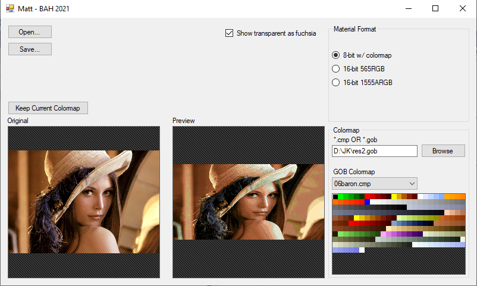

# Matt
Modern utility for converting 8-bit/16-bit .MAT files to&from typical image files.

_NOTE: readme content/screenshots may be out-of-date, but still representative_

## Overview

#### Features
* Original and Output preview renderings
* Drag'n'drop for loading any file
* Automatic rescale to powers-of-2
* Supports typical image formats
  * .BMP / .PNG / .JPG / .GIF
* Supports 8-bit MATs
  * browse for .CMP files directly
  * browse for .GOB _(eg. res2.gob)_ and allow selection of any included colormap in a convenient drop-down
* Supports 16-bit MATs
  * format 565RGB  _(best color)_
  * format 1555ARGB  _(supports transparency)_
  * format 4444ABGR _(indy only)_
* Supports 24-bit and 32-bit MATs _(3rd party expansions)_

#### Missing/Pending Features
* Single-color MAT support  _(such as used in particle effects)_
* Multi-cel MAT support  _(for switches/buttons or animated textures)_
* Control 8-bit _transparency_ fileformat field
* Control 8-bit _color index_ fileformat field
* Use fuchsia _(255/0/255)_ on incoming standard image files as an optional automatic transparency pixel value

#### Development
**Matt** implements the .MAT specification as elicited from JKSpecs, BoBo Fett's "mat-16 spec", smlu's contributions, shiny's contributions, and personal research.

---

## Tutorial

The application should be pretty easy to figure out on your own.

However, if you want step-by-step instructions then please see below for specific tasks.

#### Converting image -> .MAT
1. Open Matt.exe
2. Click `Open` or just drag a .BMP/.PNG/.JPG/.GIF file onto the program
3. Select your desired output format in the `Material Format` section
   * _`Material Format` options will auto-select based upon the image format you have loaded, but you are free to change it_
   * **If 8-bit:** Select the appropriate colormap
     * Using colormaps from GOB:
       1. In the `Colormap` section, type or browse to a .GOB file _(such as res2.gob)_
       2. Select an appropriate entry from the `GOB Colormap` drop-down
     * Using direct colormap file:
       1. In the `Colormap` section, type or browse to a .CMP file
   * **If 16-bit:** Select the desired format
     * `565RGB` provides best color detail, but does not support transparency
     * `1555ARGB` provides good color detail, and supports 1-bit transparency _(you should load a .PNG with transparency, or a 32-bit .BMP file, to use this format)_
5. Click `Save` and choose `Material Files` as the Save type

#### Converting .MAT -> image
1. Open Matt.exe
2. Click `Open` or just drag a .MAT file onto the program
   * _`Material Format` options will auto-select based upon the MAT format, to let you know what you have loaded_
3. **If 8-bit** select the appropriate colormap  _(16-bit textures do not require a colormap)_
   * Using colormaps from GOB:
     1. In the `Colormap` section, type or browse to a .GOB file _(such as res2.gob)_
     2. Select an appropriate entry from the `GOB Colormap` drop-down
   * Using direct colormap file:
     1. In the `Colormap` section, type or browse to a .CMP file
4. Click `Save` and choose `Image Files` as the Save type

---

## Advanced

There are a couple more options which may assist with some tasks.

#### `Keep Current Colormap` _(button)_
This is useful when having loaded an existing 8-bit .MAT that you want to save as a new .MAT that conforms to a different colormap.

After you have loaded the .MAT file and found its appropriate colormap, click `Keep Current Colormap`  and any further colormap selections will only affect the output.

#### [X] `Show transparent as fuchsia` _(checkbox)_
Toggle whether to fill transparent pixels as pink, or let the  "invalid image area"  background lines show through.

This is purely visual and has no effect on file output.

#### [X] `Autoselect format based on input image` _(checkbox)_
Toggle whether to automatically change the `Material Format` options based upon the file you have loaded.

This is useful to turn off when you want to lock-in your output settings, and drag a bunch of random files in.

#### [X] `Exclude self-illuminated colors (8-bit)` _(checkbox)_
Prevents using .CMP colors that have the same RGB value at min/max light level. This protects various texels from glowing in the dark when using software renderer.

#### [_] `Dither (8-bit)` _(checkbox)_
Applies a Floyd-Steinberg dithering algorithm while conforming an image to .CMP palette. Typically not needed, but available as an option for suboptimal image imports.
